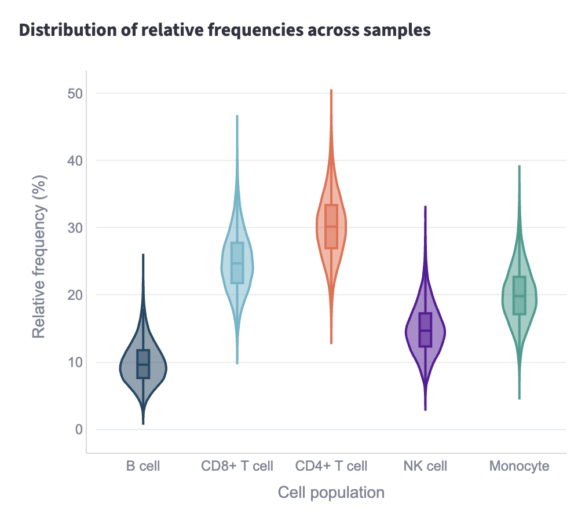
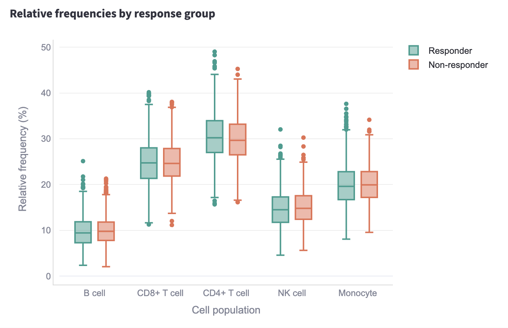
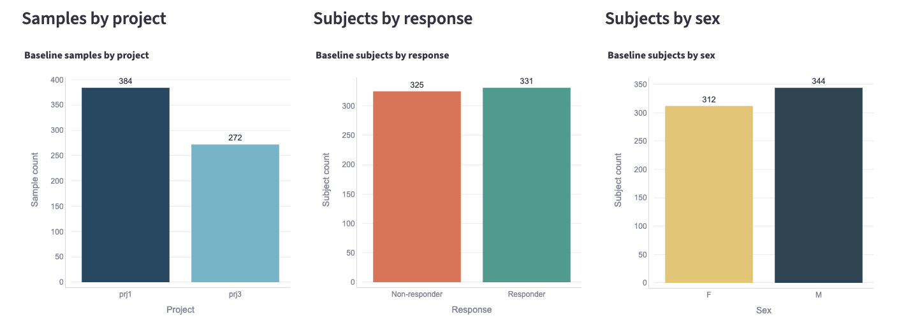

# Loblaw Bio — Immune Cell Clinical Trial Analysis

Analysis pipeline and interactive dashboard for Bob Loblaw's miraclib clinical trial, covering data loading (Part 1), cell population summaries (Part 2), responder statistical analysis (Part 3), and baseline subset queries (Part 4).

## Quick start

```bash
make setup      # install dependencies
make pipeline   # load data and generate all outputs
make dashboard  # start the interactive dashboard
```

The dashboard runs at **http://localhost:8501** after `make dashboard`.

### Manual run

```bash
pip install -r requirements.txt
python load_data.py
python run_pipeline.py
streamlit run dashboard.py
```


## Outputs

Running `make pipeline` creates:

| File | Description |
|---|---|
| `cell_counts.db` | SQLite database (repo root) |
| `outputs/cell_population_summary.csv` | Part 2: relative frequency per population per sample |
| `outputs/responder_comparison_stats.csv` | Part 3: Mann-Whitney U test results |
| `outputs/responder_comparison_boxplot.html` | Part 3: responder vs non-responder boxplot |
| `outputs/significant_populations.csv` | Part 3: populations significant at p < 0.05 |
| `outputs/baseline_samples_by_project.csv` | Part 4: sample counts by project |
| `outputs/baseline_subjects_by_response.csv` | Part 4: subject counts by response |
| `outputs/baseline_subjects_by_sex.csv` | Part 4: subject counts by sex |
| `outputs/average_b_cells_melanoma_male_responders_baseline.csv` | Part 4: average B cells for melanoma male responders at baseline |

## Database schema

Data is stored in a single SQLite table, `cell_counts`, with one row per biological sample.

| Column | Type | Description |
|---|---|---|
| `id` | INTEGER | Primary key |
| `project` | TEXT | Trial project identifier |
| `subject` | TEXT | Patient identifier |
| `condition` | TEXT | Disease indication (e.g. melanoma) |
| `age` | INTEGER | Patient age |
| `sex` | TEXT | Patient sex (M/F) |
| `treatment` | TEXT | Treatment arm |
| `response` | TEXT | Treatment response (yes/no) |
| `sample` | TEXT | Unique sample identifier |
| `sample_type` | TEXT | Sample type (e.g. PBMC) |
| `time_from_treatment_start` | INTEGER | Days from treatment start |
| `b_cell`, `cd8_t_cell`, `cd4_t_cell`, `nk_cell`, `monocyte` | INTEGER | Cell counts per population |

**Design rationale:** The CSV is already sample-level with embedded metadata and counts, so a single denormalized table mirrors the source data directly and keeps queries simple. Indexes on `sample`, `subject`, and the common filter columns (`condition`, `treatment`, `sample_type`, `time_from_treatment_start`, `response`) support the Part 3 and Part 4 queries without full table scans.

**Scaling:** For hundreds of projects, thousands of samples, and richer analytics, the schema would split into normalized tables — e.g. `projects`, `subjects`, `samples`, and `cell_populations` — to avoid redundant metadata, enforce referential integrity, and allow independent indexing and partitioning. Long-format cell counts (sample + population + count) would also simplify population-level aggregations and time-series analysis across many trials.

## Code structure

```
load_data.py      # Part 1: create schema, load cell-count.csv into SQLite
analysis.py       # Shared analysis functions and output writers (Parts 2–4)
run_pipeline.py   # Orchestrates analysis and writes all output files
dashboard.py      # Streamlit dashboard displaying Parts 2–4 interactively
Makefile          # setup, pipeline, and dashboard targets for grading
requirements.txt  # Python dependencies
cell-count.csv    # Input data
outputs/          # Generated tables and plots
```

**Layout reasoning:** `load_data.py` handles only data ingestion so the database can be rebuilt independently. `analysis.py` holds all query and statistics logic in one place, shared by both the batch pipeline and the dashboard — avoiding duplicated analysis code. `run_pipeline.py` is a thin orchestrator that calls the output writers in sequence, keeping `make pipeline` simple and predictable. `dashboard.py` is a presentation layer on top of the same functions, so interactive and batch results always stay in sync.

## Methodology

Relative frequencies are computed as each population's count divided by the sample's total cell count (sum of all five populations), expressed as a percentage.

For Part 3, melanoma PBMC samples treated with miraclib are compared between responders and non-responders using a two-sided Mann-Whitney U test per population. This test was chosen because the two response groups are independent and relative frequencies are continuous values that may not be normally distributed.

## Dashboard

Start with `make dashboard`, then open **http://localhost:8501**. The dashboard has three tabs:

1. **Part 2: Data Overview** — summary table of cell population relative frequencies
2. **Part 3: Responder Analysis** — boxplot and statistical test results
3. **Part 4: Baseline Subset** — baseline sample counts and average B cells for melanoma male responders

Some sample figures include:
#### Part 2: Data Overview



#### Part 3: Responder Analysis



#### Part 4: Baseline Subset Analysis


